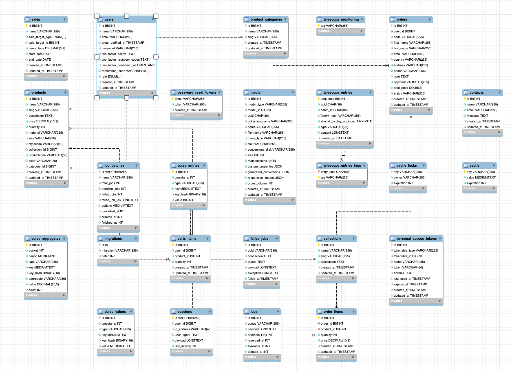

# ERD Database Documentation

## Overview

This documentation provides an overview of the Entity-Relationship Diagram (ERD) for a database designed to manage a comprehensive e-commerce platform. The database schema includes entities for managing users, products, orders, carts, and additional operational features such as job queues, monitoring, and authentication.

## Database Schema

The database schema consists of several key models, including `Users`, `Products`, `Orders`, `CartsItems`, `ProductCategories`, and others. Below is a detailed description of each model and their relationships.

### Users

Represents the users of the system, including both customers and administrators.

- **Fields:**
  - `id`: Unique identifier for the user.
  - `name`: Name of the user.
  - `email`: Email address of the user.
  - `email_verified_at`: Timestamp when the email was verified.
  - `password`: Hashed password.
  - `two_factor_secret`: Secret for two-factor authentication (optional).
  - `two_factor_recovery_codes`: Recovery codes for two-factor authentication (optional).
  - `two_factor_confirmed_at`: Timestamp when two-factor authentication was confirmed (optional).
  - `role`: Role of the user (e.g., admin, customer).

### Products

Represents the products available for purchase.

- **Fields:**
  - `id`: Unique identifier for the product.
  - `name`: Name of the product.
  - `description`: Description of the product (optional).
  - `price`: Price of the product.
  - `quantity`: Quantity of the product in stock.
  - `material`: Material of the product (optional).
  - `size`: Size of the product (optional).
  - `stylecode`: Style code of the product (optional).
  - `color`: Color of the product (optional).
  - `category_id`: Foreign key to the `ProductCategory` model.

- **Relationships:**
  - `productCategory`: A many-to-one relationship with `ProductCategory`.

### ProductCategories

Represents categories for products. Each category can have multiple products.

- **Fields:**
  - `id`: Unique identifier for the category.
  - `name`: Name of the category.
  - `slug`: URL-friendly name of the category.

- **Relationships:**
  - `products`: A one-to-many relationship with `Products`.

### Orders

Represents customer orders.

- **Fields:**
  - `id`: Unique identifier for the order.
  - `user_id`: Foreign key to the `Users` model.
  - `code`: Unique code for the order.
  - `first_name`, `last_name`: Customer’s name.
  - `email`: Customer’s email.
  - `address`: Customer’s address.
  - `phone`: Customer’s phone number.
  - `status`: Status of the order (e.g., pending, completed).
  - `payment`: Payment details.

- **Relationships:**
  - `user`: A many-to-one relationship with `Users`.
  - `orderItems`: A one-to-many relationship with `OrderItems`.

### OrderItems

Represents items in an order.

- **Fields:**
  - `id`: Unique identifier for the order item.
  - `order_id`: Foreign key to the `Orders` model.
  - `product_id`: Foreign key to the `Products` model.
  - `quantity`: Quantity of the product in the order.
  - `price`: Price of the product in the order.

- **Relationships:**
  - `order`: A many-to-one relationship with `Orders`.
  - `product`: A many-to-one relationship with `Products`.

### CartsItems

Represents items in a user’s cart.

- **Fields:**
  - `id`: Unique identifier for the cart item.
  - `user_id`: Foreign key to the `Users` model.
  - `product_id`: Foreign key to the `Products` model.
  - `quantity`: Quantity of the product in the cart.

- **Relationships:**
  - `user`: A many-to-one relationship with `Users`.
  - `product`: A many-to-one relationship with `Products`.

### Media

Represents media files such as product images.

- **Fields:**
  - `id`: Unique identifier for the media.
  - `model_id`: Foreign key to the associated model.
  - `model_type`: Type of the associated model (e.g., `Products`).
  - `name`: Name of the media file.
  - `mime_type`: MIME type of the file.
  - `disk`: Storage disk used.
  - `manipulations`: Manipulation data for the file (optional).

### Additional Tables

- **Sessions:** Tracks user sessions.
- **Password Reset Tokens:** Manages password reset functionality.
- **Job Batches:** Tracks batches of jobs for queued tasks.
- **Failed Jobs:** Logs failed queue jobs.
- **Personal Access Tokens:** Manages API tokens for authentication.

## Indexes

The schema includes indexes on fields such as `email` in `Users`, `category_id` in `Products`, and `user_id` in `Orders` to optimize query performance.

---

This database design enables robust management of e-commerce functionalities, ensuring scalability and efficiency.

